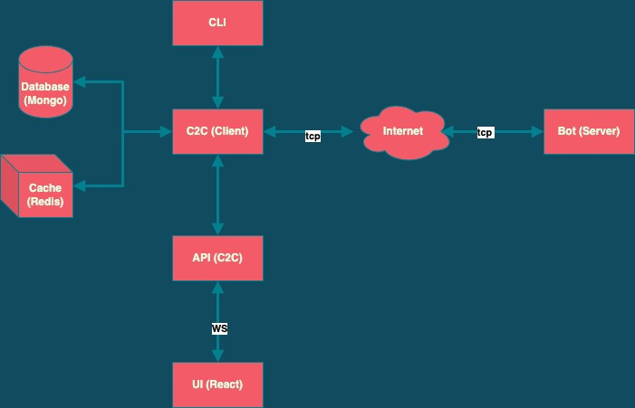

# z-botnet
Control multiple bots with tcp reverse connection implemented in Golang

## Overview



### Components

- Storage: save and check commands to execute from cache/database.
- C2C (Command and Control): Assign tasks to clients in order to execute batch/single commands.
- Bot: Running process with reverse connection to the C2C.
- CLI (Command Line Interface): Control your bots through CLI.
- API: Use the C2C implementation through API access or methods via Web Sockets.
- UI: Control the C2C throw API but with beautified graphics.

## Set Up

```bash
echo "Great steps goes here...";
```

## Roadmap
---
## MVP
### 1.0.0 - reverse connection implementation

- Reverse connection
- Healtcheck connection (ping pong)
- Remote command execution (single)
- Dockerized for testing purposes

### 1.0.1 - command execution and filtering

- Batch command execution (multiple) - all bots
- Grouped batch command executtion - bot groups
- Database storage (mongo)
---
## Integration
### 1.0.3 - attack by shell

- CLI integration
  - bot management
  - command execution (single + batch)
  - remote shell binding

### 1.1.0 - web integration

- API
  - bot management
  - command execution (single + batch)
  - cache integration (redis)

### 1.1.1 - secure web integration layer

- API
  - jwt authentication
  - user management
---
## User interface
### 1.1.2 - ui management

- UI
  - login
  - registration by invitation
  - dashboard
    - user management
    - bot management

### 1.1.3 - ui command execution

- UI
  - bot command execution
    - single
    - bash
---

## Nice to have
### 1.2.0 - ui authentication

- API
  - integration tokens
    - CLI tokens

- UI
  - integration tokens
    - CLI tokens

### 1.2.1 - stats

- UI
  - statistics

### 2.0.0 - Software Development Kit integration (SDK)

- SDK
  - bot management
  - command execution
  - porting through gomobile

### 2.0.1 - SDK authentication

- SDK
  - integration tokens
    - SDK tokens

- UI
  - integration tokens
    - SDK tokens


